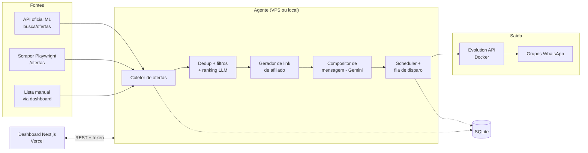

# Agente de Afiliados Mercado Livre → WhatsApp

**Documento de arquitetura e plano de implementação** · v1 · Julho/2026

---

## 1. Visão geral

Sistema agêntico que captura promoções no Mercado Livre, gera links de afiliado vinculados à sua conta, monta mensagens de venda com um LLM (Gemini, BYOK) e dispara periodicamente em grupos de WhatsApp. Um dashboard web permite configurar fontes, revisar/aprovar mensagens, acompanhar histórico e gerenciar a conexão do WhatsApp.

Princípios acordados: **tudo Node/TypeScript** (monorepo), **local-first** (roda inteiro na sua máquina, Windows/macOS/Linux, com o mínimo de setup), **BYOK** (sua chave Gemini, com abstração para trocar de provedor depois), e deploy do dashboard na **Vercel** com o agente numa **VPS Hostinger**.



---

## 2. A decisão do WhatsApp (ponderação)

Esta é a decisão mais sensível do projeto, e o cenário mudou em 2026: a Meta endureceu a detecção de clientes não-oficiais a partir de janeiro/2026, com relatos frequentes de instâncias Baileys caindo em 24–48h, falhas de QR code e banimentos mesmo de números com anos de uso e volume baixo. Ou seja, **qualquer caminho que poste em grupo hoje carrega risco real de banimento do número** — a API oficial (Cloud API), que é a única sem risco, simplesmente não envia para grupos.

**Baileys (biblioteca direta).** Conecta via pareamento como o WhatsApp Web, gratuita, leve, funciona em grupos. É a base de quase tudo no ecossistema. Contra: você gerencia sessão, reconexão e criptografia na mão dentro do seu código, e o fingerprint do Baileys é justamente o alvo principal da detecção da Meta.

**whatsapp-web.js.** Automatiza um Chromium headless rodando o WhatsApp Web de verdade. Fingerprint um pouco mais "humano" que o Baileys puro, porém muito mais pesado (um Chrome inteiro na VPS), mais lento e igualmente contra os ToS.

**Evolution API (recomendada).** Wrapper open-source sobre o Baileys que expõe uma API REST limpa, com webhook de eventos, gestão de instâncias e painel. Roda num container Docker ao lado do agente. O risco de banimento é o mesmo do Baileys (é Baileys por baixo), mas a operação fica muito mais simples: o agente só faz `POST /message/sendText`, e se a instância cair, reconectar/re-parear é um fluxo pronto — inclusive pelo dashboard. Se um dia você quiser migrar o transporte (outro wrapper, ou até Telegram), só troca o adaptador.

**Recomendação:** Evolution API, desenhando o agente com um **adaptador de transporte** (`WhatsAppSender` como interface) para que a escolha seja reversível. E, dado o cenário de 2026, operar com disciplina anti-ban:

- número/chip **dedicado e descartável** (nunca o seu pessoal), aquecido por 1–2 semanas de uso manual antes de automatizar;
- volume baixo e cadência humana: poucas mensagens/dia por grupo, intervalos com jitter aleatório, só em horário comercial, nunca rajadas;
- o número deve ser **admin ou membro antigo** dos grupos, e os grupos devem ser seus (audiência que optou por receber ofertas — isso também reduz denúncias, que são o principal gatilho de ban);
- monitorar o webhook de desconexão da Evolution e **pausar tudo automaticamente** ao primeiro sinal de restrição, alertando você no dashboard.

Vale registrar o plano B: um **canal/grupo no Telegram** via Bot API é 100% oficial, gratuito e sem risco — muitos grupos de promoção operam nos dois. Com o adaptador de transporte, adicionar Telegram depois custa pouco.

---

## 3. Captura de ofertas e geração do link de afiliado

Você escolheu as três fontes, e elas se complementam bem como **pipeline único com três entradas**:

**a) API oficial do Mercado Livre.** A API pública (`api.mercadolibre.com`) cobre busca de produtos por palavra-chave/categoria com preço, desconto e frete. Detalhe importante: nos últimos anos o ML passou a exigir aplicação registrada + OAuth para a maioria dos endpoints de busca, então o setup inclui criar um app no DevCenter do ML e guardar `client_id`/`client_secret` no `.env`. É a fonte mais estável e estruturada — ideal para "monitorar palavras-chave X, Y, Z com desconto ≥ N%".

**b) Scraping das páginas de ofertas.** `mercadolivre.com.br/ofertas` (Playwright + Chromium, que a VPS e o container já suportam) pega o que a API não expõe bem: as ofertas relâmpago e a curadoria da home de ofertas. Parser tolerante a mudança de layout, com fallback de seletores e alerta no dashboard quando o parse falhar.

**c) Lista manual.** Você cola URLs de produto no dashboard; o agente só converte para link de afiliado, compõe a mensagem e agenda. É também o modo mais seguro para validar o pipeline de ponta a ponta no início.

Tudo converge para uma tabela `offers` com dedup por `item_id` (não repostar o mesmo produto num intervalo configurável), filtros (desconto mínimo, faixa de preço, categoria, blocklist de vendedores) e um passo opcional de **ranking pelo LLM** ("das 40 ofertas coletadas, escolha as 8 mais atrativas para o público do grupo").

**O link de afiliado é o ponto sem API oficial.** O Programa de Afiliados do ML não expõe endpoint público de geração de link — a geração acontece no portal logado (o "linkbuilder" do hub de afiliados). As automações da comunidade fazem exatamente isso: autenticam com a sessão do portal e chamam o endpoint interno que o próprio linkbuilder usa. A abordagem do agente será em duas camadas:

1. **Camada rápida (HTTP):** reutilizar os cookies de sessão do portal para chamar o endpoint interno do linkbuilder (o mesmo `createUrl` que o site usa), em lote quando possível. É como os geradores em n8n e projetos open-source operam hoje.
2. **Camada de resiliência (Playwright):** quando a sessão expira ou o endpoint interno muda, o agente abre o portal via Playwright, refaz login (com você aprovando 2FA pelo dashboard na primeira vez) e renova os cookies. Sessão persistida em disco, criptografada.

Riscos assumidos e registrados: endpoint interno pode mudar sem aviso (mitigado pela camada Playwright) e automação do portal é área cinzenta nos termos do programa — volume baixo e comportamento de usuário normal mantêm o perfil discreto. O dashboard sempre mostra o status da sessão de afiliado (válida/expirada) com alerta.

---

## 4. Arquitetura de componentes

**Agente (`apps/agent`)** — processo Node/TS de longa duração (Fastify + node-cron), o único que toca ML, Gemini e WhatsApp. Expõe uma API REST autenticada por token estático (para o dashboard) e roda os jobs: coleta → filtro/ranking → link de afiliado → composição → fila de disparo. Local-first: `npm run dev` sobe tudo na sua máquina; na VPS é o mesmo código em Docker.

**Dashboard (`apps/dashboard`)** — Next.js (App Router) na Vercel. **Stateless**: não tem banco próprio; tudo que exibe e grava passa pela API do agente (`AGENT_URL` + `AGENT_TOKEN` nas env vars da Vercel). Isso mantém o modelo local-first (rodando local, o dashboard aponta para `localhost`) e evita sincronizar dois bancos. Telas: visão geral (próximos disparos, últimos enviados, status das sessões WhatsApp/afiliado), fontes e filtros, fila de aprovação (modo manual ou automático), editor do prompt de mensagem, configurações (grupos-alvo, cadência, chave Gemini), e conexão WhatsApp (QR code da Evolution renderizado no dashboard).

**Banco** — **SQLite** via Drizzle ORM, arquivo único junto ao agente. Zero setup local, backup = copiar um arquivo, e a VPS não precisa de Postgres. Tabelas principais: `offers`, `affiliate_links`, `messages` (com status draft → approved → scheduled → sent/failed), `groups`, `settings`, `runs` (log de execuções).

**Evolution API** — container Docker próprio, na mesma rede do agente, nunca exposto publicamente (só o agente fala com ele).

**LLM (BYOK)** — integração via **Vercel AI SDK** com o provider do Google (`@ai-sdk/google`): a chave Gemini fica no `.env`/dashboard e trocar de provedor (OpenAI, Anthropic, Ollama local) vira uma linha, o que cumpre o requisito BYOK de verdade. O LLM tem dois papéis: ranquear ofertas e compor a mensagem (template + emoji + urgência + link), sempre com um template determinístico de fallback caso a API falhe — o disparo nunca fica refém do LLM.

---

## 5. Estrutura do monorepo

```
ml-affiliate-agent/
├── apps/
│   ├── agent/              # Fastify + jobs (deploy: VPS)
│   │   ├── src/
│   │   │   ├── sources/    # ml-api.ts, scraper.ts, manual.ts
│   │   │   ├── affiliate/  # linkbuilder.ts (HTTP + Playwright)
│   │   │   ├── llm/        # ranking.ts, composer.ts (AI SDK)
│   │   │   ├── whatsapp/   # sender.ts (interface) + evolution.ts
│   │   │   ├── scheduler/  # cron, jitter, janelas de envio
│   │   │   └── api/        # rotas REST p/ dashboard
│   │   └── Dockerfile
│   └── dashboard/          # Next.js (deploy: Vercel)
├── packages/
│   ├── core/               # tipos, schemas zod, config compartilhada
│   └── db/                 # Drizzle schema + migrações (SQLite)
├── docker-compose.yml      # agent + evolution-api (VPS e local opcional)
├── .env.example            # TODAS as variáveis documentadas
└── README.md               # setup em ~10 passos, Win/Mac/Linux
```

pnpm workspaces + Turborepo. O README é parte do produto: pré-requisitos (Node 20+, pnpm, Docker opcional local), `pnpm install`, copiar `.env.example`, `pnpm dev` — e o dashboard local guia o resto (conectar WhatsApp, logar no portal de afiliados, colar a chave Gemini).

---

## 6. Deploy

**Dashboard → Vercel.** Conectar o repo, root `apps/dashboard`, env vars `AGENT_URL` e `AGENT_TOKEN`. Sem banco na Vercel, o deploy é trivial e o free tier basta.

**Agente → VPS Hostinger.** `docker-compose.yml` com dois serviços (`agent`, `evolution`) + volume para o SQLite e a sessão. Na frente, **Caddy** como reverse proxy com TLS automático num subdomínio (ex.: `agente.seudominio.com`) — necessário porque a Vercel precisa alcançar a API do agente por HTTPS. Setup da VPS documentado em ~6 comandos (instalar Docker, clonar, `.env`, `docker compose up -d`). Backup: cron diário copiando o arquivo SQLite.

**Segurança:** tudo sensível só no `.env` (chave Gemini, token do agente, credenciais ML); Evolution sem porta pública; API do agente só aceita requests com o token; cookies de sessão do portal criptografados em disco.

---

## 7. Roadmap de implementação

| Fase | Entrega | O que valida |
|---|---|---|
| **1 — Núcleo (MVP)** | Monorepo + fonte manual → link de afiliado → mensagem via Gemini → envio em 1 grupo via Evolution, agendado. CLI/config simples, sem dashboard. | O caminho crítico inteiro: sessão do portal, geração de link, Evolution estável, cadência anti-ban. |
| **2 — Fontes automáticas** | API oficial ML (app OAuth) + scraper de /ofertas, dedup, filtros, ranking LLM. | Qualidade e volume da captura. |
| **3 — Dashboard** | Next.js completo: fila de aprovação, QR do WhatsApp, status de sessões, configurações. Deploy Vercel. | Operação sem tocar em terminal. |
| **4 — Produção** | Docker Compose na VPS Hostinger, Caddy/TLS, backups, alertas de desconexão/ban, hardening. | Rodar sozinho, com você só supervisionando. |

Ordem proposta de propósito: a fase 1 ataca primeiro os dois pontos de maior risco (linkbuilder sem API oficial e estabilidade do WhatsApp em 2026). Se algum deles se provar inviável, você descobre na primeira semana, não na última.

---

## 8. Riscos principais

| Risco | Probabilidade | Mitigação |
|---|---|---|
| Ban do número WhatsApp (crackdown Meta 2026) | Alta ao longo do tempo | Número dedicado, cadência humana, pausa automática ao 1º sinal, adaptador pronto p/ Telegram |
| Endpoint interno do linkbuilder mudar | Média | Camada Playwright de renovação + alerta no dashboard |
| Sessão do portal de afiliados expirar | Alta (rotina) | Renovação automática via Playwright, 2FA aprovado por você |
| Layout de /ofertas mudar (scraper quebrar) | Média | API oficial como fonte primária; scraper com fallback e alerta |
| Suspensão da conta de afiliado por automação | Baixa–média | Volume discreto, comportamento de usuário normal, links só dos seus grupos |

---

## 9. Próximo passo

Com este documento aprovado (ou ajustado), a próxima sessão começa a **Fase 1**: scaffold do monorepo e o pipeline mínimo manual → link → mensagem → grupo. Pontos que ainda dependem de você: criar o app no DevCenter do ML, ter um número dedicado para o WhatsApp e a chave da Gemini API.
